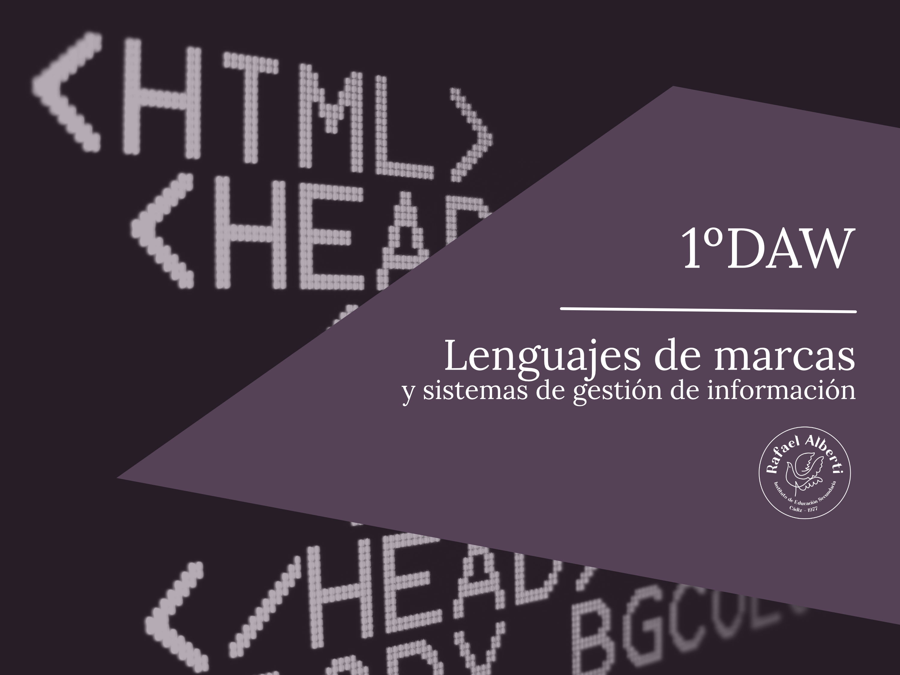

# Lenguajes de Marcas

  

Material didáctico del módulo Lenguajes de Marcas Web del CFGS Desarrollo de aplicaciones web del IES Rafael Alberti.

  

## Diapositivas

- [Presentación del módulo](https://envasador.github.io/LMGSI/slides/#)

## Referencias

- [Referencias del curso](https://envasador.github.io/LMGSI/docs/referencias)

## Proyectos
- [Proyectos del curso](https://envasador.github.io/LMGSI/#)
